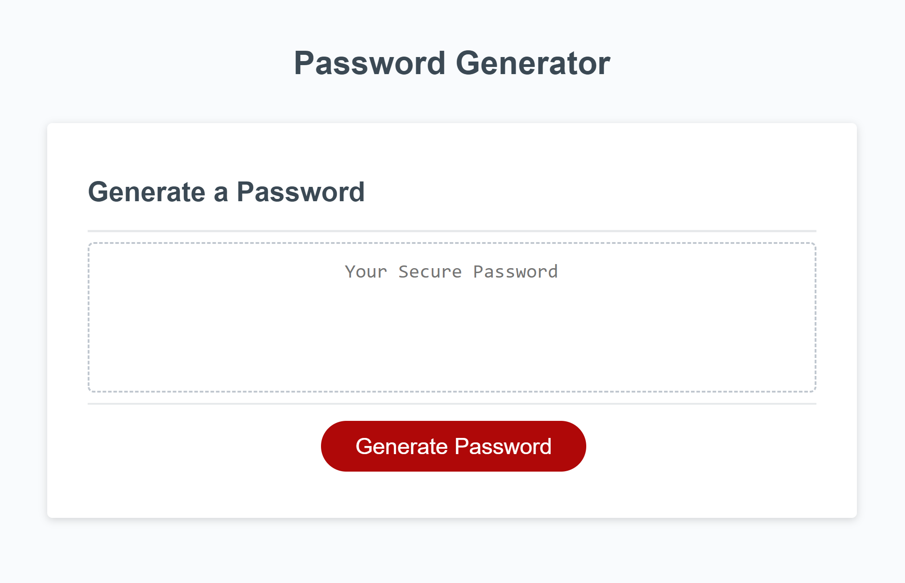

# Password Generator

## Description
This is a small project to practice implementing Javascript. This is after the third week of Coding Bootcamp at UCSD Extended Studies. You will find a password generator to aid those who have trouble thinking of a secure password. The window will prompt the user to choose the length of the password as well as which of the character types they wish to include (lower case letters, upper case letters, numbers, and special characters).

Most difficult part of this project is to have the password fulfill everything the user wanted. For a shorter password length such as 8 characters, the randomizer may not include at least one of each criteria the user wants. That has been solved by forcing one character to be selected from one true array, while the rest can be random.

Project objectives:
GIVEN I need a new, secure password
WHEN I click the button to generate a password
THEN I am presented with a series of prompts for password criteria
WHEN prompted for password criteria
THEN I select which criteria to include in the password
WHEN prompted for the length of the password
THEN I choose a length of at least 8 characters and no more than 128 characters
WHEN asked for character types to include in the password
THEN I confirm whether or not to include lowercase, uppercase, numeric, and/or special characters
WHEN I answer each prompt
THEN my input should be validated and at least one character type should be selected
WHEN all prompts are answered
THEN a password is generated that matches the selected criteria
WHEN the password is generated
THEN the password is either displayed in an alert or written to the page

## Installation
Please run the program on a browser window. Ideally a computer for better visuals, however phone/tablet browser works as well.

## Usage
Please find deployed link here:
https://twqueen.github.io/Module3-Challenge/

## Credits
* Base code found here: https://github.com/coding-boot-camp/friendly-parakeet
* List of special characters: https://owasp.org/www-community/password-special-characters
* Simple random password generator reference: https://dev.to/code_mystery/random-password-generator-using-javascript-6a
* Everything learned from UCSD Extended Studies

## License
N/A

## Features
Allows for an effortless random string of characters that can be used as a secure password. If you do use the password generated on the site, please remember to copy it in a safe location for future use. Random passwords are easily forgotten. Unfortunately there is no button click copy and past function. Please use the old school way of highlighting the text and copy/paste to your desired designation.

## How to Contribute
If you would like to add to this website or make any changes, feel free to clone it and play around with the codes. Any suggestions will be welcome as well! Thank you!
